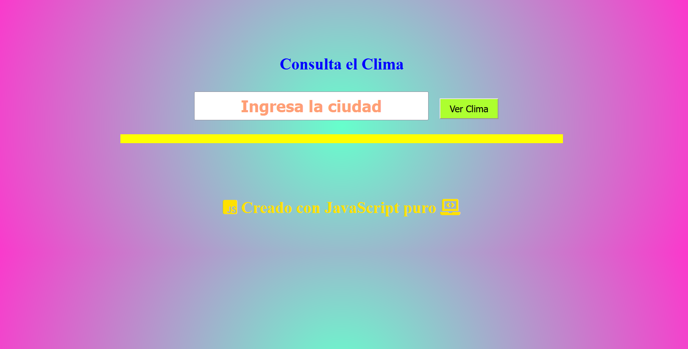
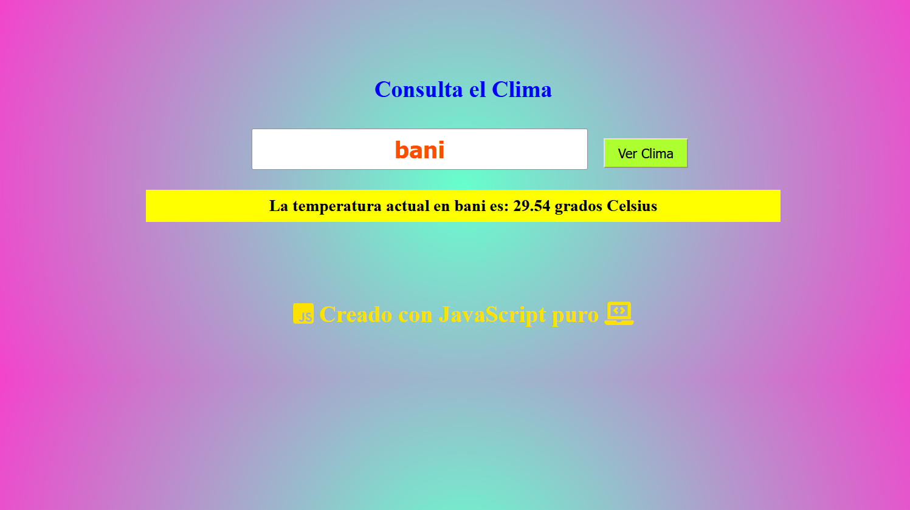
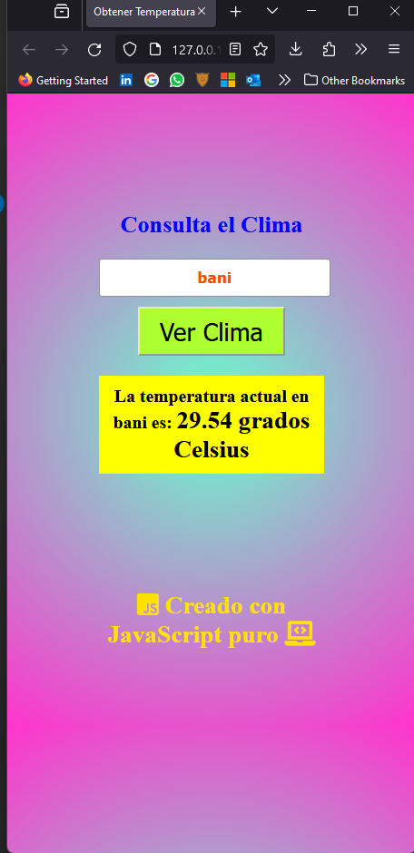

# Aplicación del Clima con JavaScript Puro

Esta es una aplicación web simple que muestra la temperatura actual de una ciudad utilizando HTML, CSS y JavaScript puro. Se integra con la API de OpenWeatherMap para obtener datos meteorológicos actualizados.

## Características

- **Interfaz Amigable:** Diseño minimalista con un fondo degradado, campo de entrada y botón.
- **Información Instantánea:** Proporciona la temperatura actual en grados Celsius de la ciudad ingresada.
- **Uso de API:** Se conecta con la API de OpenWeatherMap para obtener datos en tiempo real.
- **Facilidad de Uso:** Intuitivo y perfecto para principiantes en desarrollo web.

## Tecnologías Utilizadas

- HTML5
- CSS3
- JavaScript (ES6+)
- API de OpenWeatherMap

## Cómo Usar

1. Clona este repositorio a tu máquina local.
2. Abre el archivo `index.html` en tu navegador web.
3. Ingresa el nombre de una ciudad y presiona el botón "Ver Clima".
4. ¡Disfruta de la temperatura actual de la ciudad seleccionada!

## Capturas de Pantalla

_Descripción opcional de la captura de pantalla 1._

_Descripción opcional de la captura de pantalla 2._

## Contribución

Si deseas contribuir a este proyecto, ¡eres bienvenido! Siéntete libre de abrir un issue o enviar un pull request.

## Autor

Este proyecto fue creado por [Juancito Peña V.] - 

### Puedes Leer el Articulo aqui:
[https://advisertecnology.com/index.php/2023/11/22/html-css-javascript-y-openweathermap-explorando-el-clima-a-traves-del-desarrollo-web/#].

## Agradecimientos

Agradecimientos especiales a OpenWeatherMap por proporcionar la API de Clima.

---

¡Espero que encuentres este proyecto útil y educativo! No dudes en explorarlo y agregar nuevas funcionalidades.
